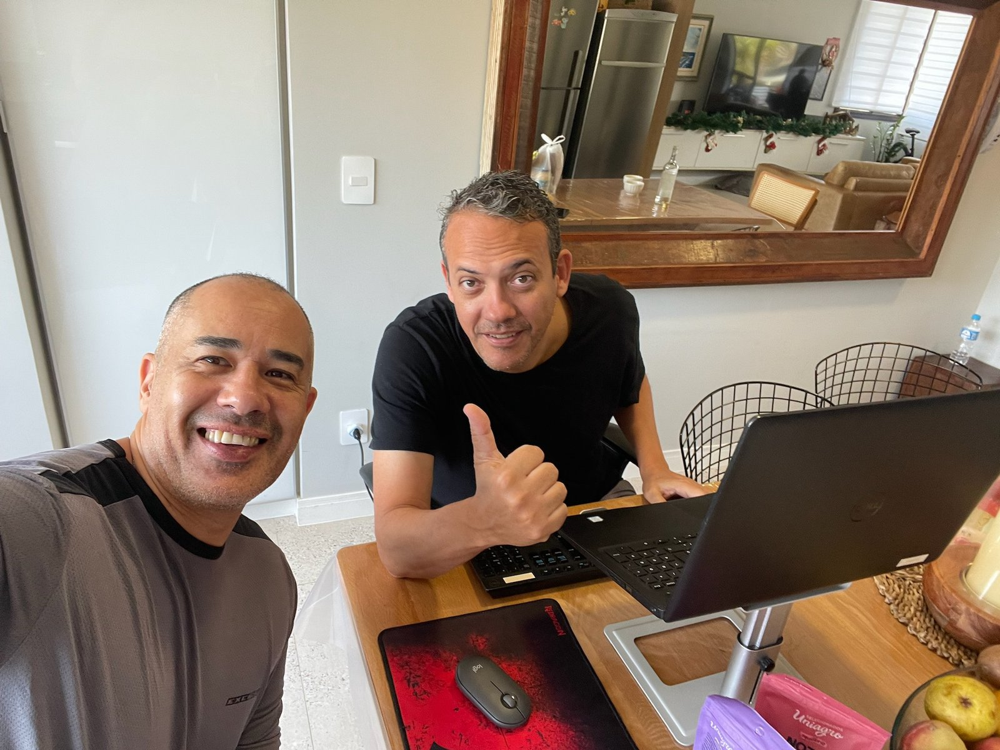

# fotos-amigos

**Fotos entre Amigos** — álbum digital em página estática. Sem build, sem dependências, sem servidor: é só abrir o `index.html`.


---

## Como abrir

**Mais simples:** clique duplo em `index.html`.

**Servidor local** (recomendado, evita bloqueios de `file://` em alguns navegadores):

```bash
python -m http.server 8000
# depois abra http://localhost:8000
```

## Estrutura

```
fotos-amigos/
├── index.html    estrutura da página
├── style.css     visual (moderno & minimalista)
├── script.js     lightbox, filtros, espaços reservados
└── fotos/        as imagens do álbum (18 arquivos)
```

## Funcionalidades

- **Grid masonry** — fotos paisagem e retrato lado a lado, **sem corte** de nenhuma imagem.
- **Lightbox** com setas, teclado (`←` `→` `Esc` `Home` `End`), swipe no celular e pré-carregamento das vizinhas.
- **Filtros por mês** — Todas · Setembro · Outubro.
- **102 espaços reservados** (Espaço 19 → 120) para as próximas fotos.
- Animação de entrada, barra de progresso e botão de voltar ao topo.
- Responsivo e acessível (`aria-*`, foco visível, `prefers-reduced-motion`).

## Como adicionar fotos

### 1. Rápido (só neste navegador)

Clique em um **espaço vazio**, no botão **+ Adicionar fotos**, ou **arraste as imagens para cima da página**.

> ⚠️ Essas fotos aparecem na hora, mas **não são salvas** — valem enquanto a aba estiver aberta.

### 2. Definitivo (fica no álbum)

1. Copie os arquivos para dentro da pasta `fotos/`.
2. No `index.html`, copie um bloco `<figure class="photo-card">` existente e ajuste:

```html
<figure class="photo-card reveal" data-collection="outubro" data-date="6 de outubro de 2026">
  <button class="photo-card__open" type="button" aria-label="Ampliar foto 19 de 19">
    
    <span class="photo-card__meta">
      <span class="photo-card__date">6 de outubro de 2026</span>
      <span class="photo-card__zoom" aria-hidden="true">…</span>
    </span>
  </button>
</figure>
```

3. Repita o mesmo `data-collection` para as fotos do mesmo mês. Use um valor novo (ex.: `data-collection="novembro"`) para criar um filtro automaticamente.

Os contadores, os chips de filtro, os espaços reservados e os rótulos de acessibilidade **se atualizam sozinhos** — não é preciso editar números.

> `width` e `height` no `` são importantes: eles mantêm o layout estável enquanto a imagem carrega.

## Publicar no GitHub Pages

1. **Settings → Pages**
2. Em *Source*, escolha **Deploy from a branch**
3. Selecione a branch `main` e a pasta `/ (root)` → **Save**

Pronto: o álbum fica em `https://<usuario>.github.io/fotos-amigos/`.

## Tecnologias

HTML, CSS e JavaScript puros. As fontes vêm do Google Fonts (Inter e Instrument Serif).
